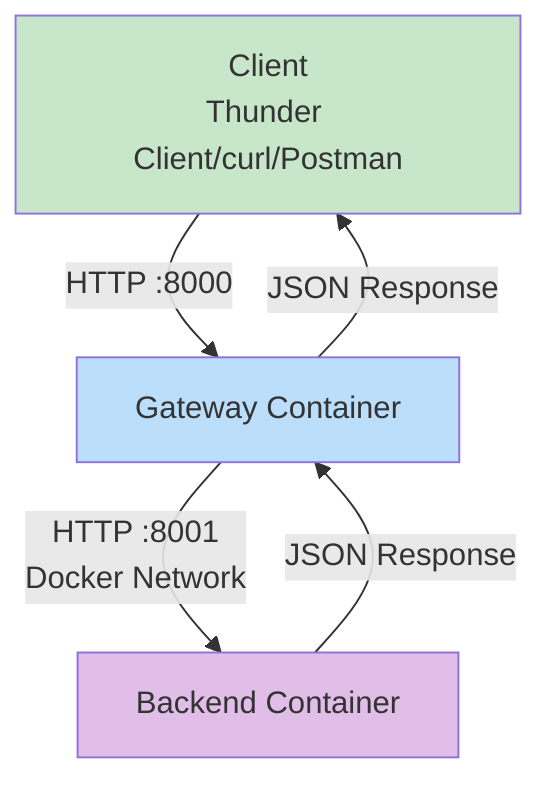

# Cloud Computing Project: Secure API Gateway

**Student:** Katherine Sunday  
**Course:** CSC581-01 Introduction to Cloud Computing  
**Repository:** `https://github.com/KS895683/CSC581_Cloud_Project.git`

---

## Vision

### Architecture Diagram

---

### Component Communication

1. **Testing Client**: Thunder Client (VS Code extension), curl, or Postman
2. **External Access**: Client → Gateway via HTTP port 8000
3. **Internal Routing**: Gateway → Backend via HTTP port 8001 (Docker internal)
4. **Data Format**: REST API with JSON request/response payloads
5. **Service Discovery**: Docker's internal DNS using container names

## Proposal

### Component 1: API Gateway (Custom Dockerfile)

- **Base Image**: `python:3.11-slim`
- **Reason**: General-purpose applications, balancing size with broad library support
- **Access**: External access via `http://localhost:8000` for testing

### Component 2: Backend Service  

- **Base Image**: `python:3.11-alpine`
- **Reason**: Extremely small image size, reduced attack surface, great for minimal environments
- **Access**: Internal only, accessed via Gateway forwarding