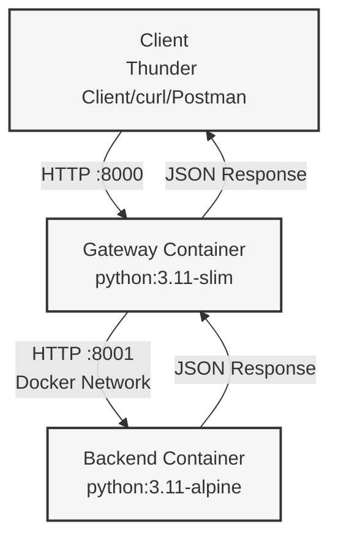

# Cloud Computing Project: Secure API Gateway

**Student:** Katherine Sunday  
**Course:** CSC581-01 Introduction to Cloud Computing  
**Repository:** `https://github.com/KS895683/CSC581_Cloud_Project.git`

---

## Vision

### Architecture Diagram


```mermaid
graph TD
    A[Client<br/>Thunder Client/curl/Postman] -->|HTTP :8000| B[Gateway Container<br/>python:3.11-slim]
    B -->|HTTP :8001<br/>Docker Network| C[Backend Container<br/>python:3.11-alpine]
    C -->|JSON Response| B
    B -->|JSON Response| A
    
    style A fill:#f5f5f5,stroke:#333,stroke-width:2px
    style B fill:#f5f5f5,stroke:#333,stroke-width:2px
    style C fill:#f5f5f5,stroke:#333,stroke-width:2px

```

---

### Component Communication

1. **Testing Client**: Thunder Client (VS Code extension), curl, or Postman
2. **External Access**: Client → Gateway via HTTP port 8000
3. **Internal Routing**: Gateway → Backend via HTTP port 8001 (Docker internal)
4. **Data Format**: REST API with JSON request/response payloads
5. **Service Discovery**: Docker's internal DNS using container names

## Proposal

### Component 1: API Gateway (Custom Dockerfile)

- **Base Image**: `python:3.11-slim`
- **Reason**: General-purpose applications, balancing size with broad library support
- **Access**: External access via `http://localhost:8000` for testing

### Component 2: Backend Service  

- **Base Image**: `python:3.11-alpine`
- **Reason**: Extremely small image size, reduced attack surface, great for minimal environments
- **Access**: Internal only, accessed via Gateway forwarding


## Build Process

### Gateway Dockerfile Analysis

```dockerfile
FROM python:3.11-slim

RUN useradd -m -u 1000 appuser && \
    mkdir -p /app && \
    chown -R appuser:appuser /app

WORKDIR /app

COPY requirements.txt .
RUN pip install --no-cache-dir -r requirements.txt

COPY app.py .

USER appuser

EXPOSE 8000

HEALTHCHECK --interval=30s --timeout=3s --start-period=5s --retries=3 \
  CMD python -c "import requests; requests.get('http://localhost:8000/health', timeout=2)"

CMD ["uvicorn", "app:app", "--host", "0.0.0.0", "--port", "8000"]
Line-by-line explanation:

FROM python:3.11-slim: Uses the slim Python image for balanced size (~120MB) and compatibility

RUN useradd -m -u 1000 appuser: Creates a non-root user (UID 1000) for security (A-level requirement)

WORKDIR /app: Sets the working directory inside the container

COPY requirements.txt .: Copies requirements first for Docker layer caching

RUN pip install --no-cache-dir -r requirements.txt: Installs dependencies without saving cache (reduces image size)

COPY app.py .: Copies the application code

USER appuser: Switches to non-root user before running the app

EXPOSE 8000: Documents that the container listens on port 8000

HEALTHCHECK: Allows Docker to monitor container health and restart if unhealthy

CMD: Starts the FastAPI application with uvicorn server

Backend Dockerfile Analysis
dockerfile
FROM python:3.11-alpine

RUN adduser -D -u 1000 backenduser && \
    mkdir -p /app && \
    chown -R backenduser:backenduser /app

WORKDIR /app

COPY requirements.txt .
RUN pip install --no-cache-dir -r requirements.txt

COPY app.py .

USER backenduser

EXPOSE 8001

HEALTHCHECK --interval=30s --timeout=3s --start-period=5s --retries=3 \
  CMD python -c "import requests; requests.get('http://localhost:8001/health', timeout=2)"

CMD ["uvicorn", "app:app", "--host", "0.0.0.0", "--port", "8001"]
Line-by-line explanation:

FROM python:3.11-alpine: Uses Alpine Linux for minimal size (~40MB) and reduced attack surface

RUN adduser -D -u 1000 backenduser: Creates non-root user (Alpine uses adduser -D instead of useradd)

WORKDIR /app: Sets working directory

COPY requirements.txt .: Copies dependencies first for caching

RUN pip install --no-cache-dir -r requirements.txt: Installs only FastAPI and uvicorn

COPY app.py .: Copies the backend application

USER backenduser: Switches to non-root user

EXPOSE 8001: Internal port (not exposed to host)

HEALTHCHECK: Ensures backend is ready before accepting traffic

CMD: Starts the backend FastAPI application

```markdown
## Networking

### Docker Bridge Network

The project uses a **user-defined bridge network** for container communication:

```yaml
networks:
  api-network:
    driver: bridge
Why bridge network?

Isolates containers from host network

Enables DNS-based service discovery

Allows controlled port exposure (only Gateway exposed externally)

```markdown
## Networking

### Docker Bridge Network

The project uses a **user-defined bridge network** for container communication:

```yaml
networks:
  api-network:
    driver: bridge
    