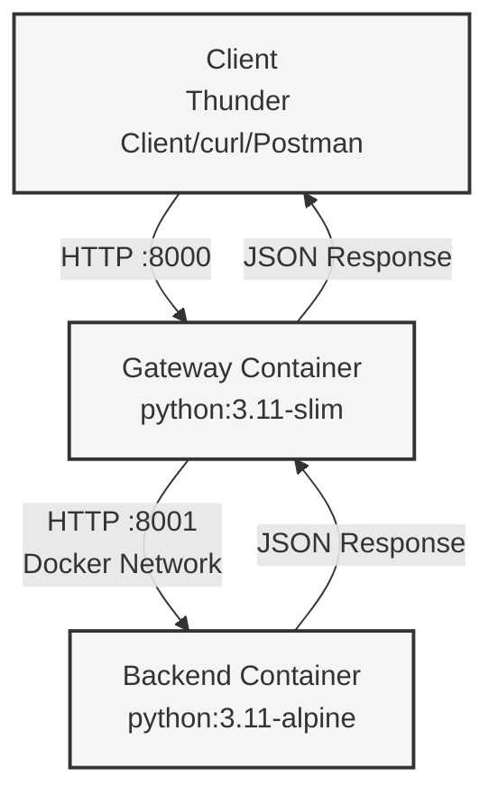

# Cloud Computing Project: Secure API Gateway

**Student:** Katherine Sunday  
**Course:** CSC581-01 Introduction to Cloud Computing  
**Repository:** `https://github.com/KS895683/CSC581_Cloud_Project.git`

---

## Project Purpose

This project implements an **API Gateway** that protects backend services from abuse and provides a single entry point for client applications. The gateway demonstrates three core infrastructure patterns:

1. **Rate Limiting**: Prevents denial-of-service attacks by limiting clients to 10 requests per minute
2. **Security Hardening**: Runs containers as non-root users with dropped capabilities
3. **Service Isolation**: Backend services are hidden from external access, only reachable through the gateway

This is a real-world cloud infrastructure pattern used by companies like Netflix, Amazon, and Uber to secure and manage their microservices architectures. The gateway acts as a **security guard and traffic cop** for the backend service.

---
## Vision

### What This Project Does

The API Gateway serves as the **single entry point** for all client requests. When a client makes a request:

1. The gateway **checks if the client has exceeded their rate limit** (10 requests per minute)
2. If the limit is exceeded, the client receives a `429 Too Many Requests` response
3. If within limits, the gateway **forwards the request** to the backend service
4. The backend processes the request and returns data
5. The gateway adds tracking headers and returns the response to the client

This protects the backend from being overwhelmed by too many requests - a common security concern in cloud applications.

---
### Architecture Diagram


```mermaid
graph TD
    A[Client<br/>Thunder Client/curl/Postman] -->|HTTP :8000| B[Gateway Container<br/>python:3.11-slim]
    B -->|HTTP :8001<br/>Docker Network| C[Backend Container<br/>python:3.11-alpine]
    C -->|JSON Response| B
    B -->|JSON Response| A
    
    style A fill:#f5f5f5,stroke:#333,stroke-width:2px
    style B fill:#f5f5f5,stroke:#333,stroke-width:2px
    style C fill:#f5f5f5,stroke:#333,stroke-width:2px

```

---

### Component Communication

1. **Testing Client**: Thunder Client (VS Code extension), curl, or Postman
2. **External Access**: Client → Gateway via HTTP port 8000
3. **Internal Routing**: Gateway → Backend via HTTP port 8001 (Docker internal)
4. **Data Format**: REST API with JSON request/response payloads
5. **Service Discovery**: Docker's internal DNS using container names

## Proposal

### Component 1: API Gateway (Custom Dockerfile)

- **Base Image**: `python:3.11-slim`
- **Reason**: General-purpose applications, balancing size with broad library support
- **Access**: External access via `http://localhost:8000` for testing

### Component 2: Backend Service  

- **Base Image**: `python:3.11-alpine`
- **Reason**: Extremely small image size, reduced attack surface, great for minimal environments
- **Access**: Internal only, accessed via Gateway forwarding

---

## Build Process

### Gateway Dockerfile Analysis
```dockerfile
FROM python:3.11-slim

RUN useradd -m -u 1000 appuser && \
    mkdir -p /app && \
    chown -R appuser:appuser /app

WORKDIR /app

COPY requirements.txt .
RUN pip install --no-cache-dir -r requirements.txt

COPY app.py .

USER appuser

EXPOSE 8000

HEALTHCHECK --interval=30s --timeout=3s --start-period=5s --retries=3 \
  CMD python -c "import requests; requests.get('http://localhost:8000/health', timeout=2)"

CMD ["uvicorn", "app:app", "--host", "0.0.0.0", "--port", "8000"]
```

**Line-by-line explanation:**

- `FROM python:3.11-slim` - uses the slim Python image for balanced size (~120MB) and compatibility
- `RUN useradd -m -u 1000 appuser` - creates a non-root user (UID 1000) for security
- `WORKDIR /app` - sets the working directory inside the container
- `COPY requirements.txt .` - copies requirements first for Docker layer caching
- `RUN pip install --no-cache-dir -r requirements.txt` - installs dependencies without saving cache (reduces image size)
- `COPY app.py .` - copies the application code
- `USER appuser` - switches to non-root user before running the app
- `EXPOSE 8000` - documents that the container listens on port 8000
- `HEALTHCHECK` - allows Docker to monitor container health and restart if unhealthy
- `CMD` - starts the FastAPI application with uvicorn server

---

### Backend Dockerfile Analysis
```dockerfile
FROM python:3.11-alpine

RUN adduser -D -u 1000 backenduser && \
    mkdir -p /app && \
    chown -R backenduser:backenduser /app

WORKDIR /app

COPY requirements.txt .
RUN pip install --no-cache-dir -r requirements.txt

COPY app.py .

USER backenduser

EXPOSE 8001

HEALTHCHECK --interval=30s --timeout=3s --start-period=5s --retries=3 \
  CMD python -c "import requests; requests.get('http://localhost:8001/health', timeout=2)"

CMD ["uvicorn", "app:app", "--host", "0.0.0.0", "--port", "8001"]
```

**Line-by-line explanation:**

- `FROM python:3.11-alpine` - uses Alpine Linux for minimal size (~40MB) and reduced attack surface
- `RUN adduser -D -u 1000 backenduser` - creates non-root user (Alpine uses `adduser -D` instead of `useradd`)
- `WORKDIR /app` - sets working directory
- `COPY requirements.txt .` - copies dependencies first for caching
- `RUN pip install --no-cache-dir -r requirements.txt` - Installs only FastAPI and uvicorn
- `COPY app.py .` - copies the backend application
- `USER backenduser` - switches to non-root user
- `EXPOSE 8001` - internal port (not exposed to host)
- `HEALTHCHECK` - ensures backend is ready before accepting traffic
- `CMD` - starts the backend FastAPI application

---

## Networking

### Docker Bridge Network

The project uses a **user-defined bridge network** for container communication:
```yaml
networks:
  api-network:
    driver: bridge
```

**Why bridge network?**

- Isolates containers from host network
- Enables DNS-based service discovery
- Allows controlled port exposure (only Gateway exposed externally)

---

### DNS Resolution by Container Name

Docker provides automatic DNS resolution for containers on the same network:
```python
# In gateway/app.py
BACKEND_URL = "http://backend:8001"
```

- `backend` resolves to the backend container's IP address automatically
- No need for static IPs or manual `/etc/hosts` configuration
- Service discovery happens out-of-the-box

---

### Network Configuration Summary

| Service | Network Access     | Port Mapping       | Purpose                        |
|---------|--------------------|--------------------|--------------------------------|
| Gateway | External + Internal | `8000:8000`       | Accepts client requests        |
| Backend | Internal Only      | `8001` (exposed)   | Only accessible via Gateway    |

---

### Why Internal-Only for Backend?

1. **Security**: Reduces attack surface (only one entry point to the system)
2. **Architecture**: Enforces single entry point pattern
3. **Simplified Firewall**: Only one port needs external protection

---

### Testing Network Connectivity
```bash
# Access gateway (external)
curl http://localhost:8000/health

# Gateway internally reaches backend via DNS
curl http://localhost:8000/api/data
```

