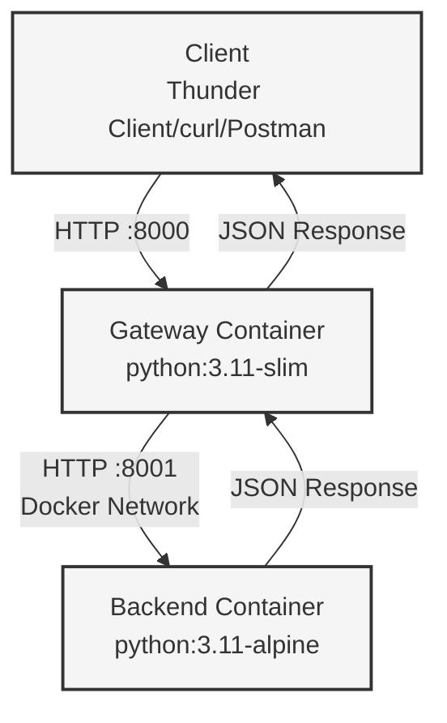

# Cloud Computing Project: Secure API Gateway

**Student:** Katherine Sunday  
**Course:** CSC581-01 Introduction to Cloud Computing  
**Repository:** `https://github.com/KS895683/CSC581_Cloud_Project.git`

---

## Project Purpose

This project implements an API Gateway that protects backend services from abuse and provides a single entry point for client applications. The gateway demonstrates three core infrastructure patterns: rate limiting to prevent denial-of-service attacks by restricting clients to 10 requests per minute, security hardening by running containers as non-root users with dropped capabilities, and service isolation where backend services are hidden from external access and only reachable through the gateway. This architecture mirrors real-world cloud infrastructure patterns used by companies like Netflix, Amazon, and Uber to secure and manage their microservices deployments.

---

## Vision

### What This Project Does

The API Gateway serves as the single entry point for all client requests. When a client makes a request, the gateway first checks whether the client has exceeded the rate limit of 10 requests per minute. If the limit is exceeded, the client receives a `429 Too Many Requests` response. If the request is within limits, the gateway forwards the request to the backend service, which processes the request and returns data. The gateway then adds tracking headers and returns the response to the client. This design protects the backend from being overwhelmed by excessive requests, a common security concern in cloud applications.

### Architecture Diagram


```mermaid
graph TD
    A[Client<br/>Thunder Client/curl/Postman] -->|HTTP :8000| B[Gateway Container<br/>python:3.11-slim]
    B -->|HTTP :8001<br/>Docker Network| C[Backend Container<br/>python:3.11-alpine]
    C -->|JSON Response| B
    B -->|JSON Response| A
    
    style A fill:#f5f5f5,stroke:#333,stroke-width:2px
    style B fill:#f5f5f5,stroke:#333,stroke-width:2px
    style C fill:#f5f5f5,stroke:#333,stroke-width:2px

```

---

## Component Communication

The system uses a REST API architecture with JSON payloads for all data exchange. Client requests are received by the API Gateway on external port 8000. The gateway then forwards valid requests to the backend service via internal port 8001 using Docker's internal bridge network. Service discovery is handled automatically through Docker's internal DNS resolution by container name, eliminating the need for static IP addresses or manual host file configuration.

---

## Proposal

### Component 1: API Gateway (Custom Dockerfile)

The API Gateway uses python:3.11-slim as its base image. This choice provides a balance between image size and library compatibility, making it suitable for general-purpose applications. The gateway is accessible externally at `http://localhost:8000` for testing purposes.

### Component 2: Backend Service

The backend service uses python:3.11-alpine as its base image. This Alpine Linux variant offers an extremely small image size of approximately 40MB and a reduced attack surface, making it ideal for minimal environments. The backend is only accessible internally through the gateway, never exposed directly to external clients.

---

## Build Process

### Gateway Dockerfile Analysis

The Gateway Dockerfile begins with FROM python:3.11-slim, which provides a minimal Python environment that balances size and compatibility. The next instruction RUN useradd -m -u 1000 appuser creates a dedicated non-root user with UID 1000, a security requirement for the A-level grade. The working directory is set to /app using WORKDIR /app. Dependencies are installed by first copying requirements.txt and running pip install --no-cache-dir -r requirements.txt; copying requirements before application code optimizes Docker layer caching. The application code is copied with COPY app.py .. The instruction USER appuser switches to the non-root user before the application runs, ensuring all processes execute without root privileges. EXPOSE 8000 documents that the container listens on port 8000, though this is primarily informational. The HEALTHCHECK instruction enables Docker to monitor container health and automatically restart unhealthy containers. Finally, CMD ["uvicorn", "app:app", "--host", "0.0.0.0", "--port", "8000"] starts the FastAPI application using the uvicorn server.

### Backend Dockerfile Analysis

The Backend Dockerfile uses FROM python:3.11-alpine, an Alpine Linux variant that provides a minimal image of approximately 40MB with a reduced attack surface. The instruction RUN adduser -D -u 1000 backenduser creates a non-root user; note that Alpine uses adduser -D instead of the useradd command found in Debian-based images. The working directory is set to /app and the requirements file is copied. Dependencies are installed with pip install --no-cache-dir -r requirements.txt, which installs only FastAPI and uvicorn. The application code is copied, and the user switches to the non-root user with USER backenduser. Port 8001 is exposed but this port is internal only and not accessible from the host machine. The healthcheck ensures the backend is ready before accepting traffic, and the CMD instruction starts the FastAPI application on port 8001.

---

## Networking

### Docker Bridge Network

The project uses a user-defined bridge network for container communication, defined in the docker-compose.yml file as api-network with the bridge driver. A bridge network isolates containers from the host network while enabling DNS-based service discovery. It also allows controlled port exposure, with only the gateway exposed externally.

### DNS Resolution by Container Name

Docker provides automatic DNS resolution for containers on the same network. In the gateway application code, the backend URL is defined as `http://backend:8001`. The hostname backend resolves automatically to the backend container's IP address without requiring static IPs or manual /etc/hosts configuration. This out-of-the-box service discovery is a key feature of Docker networking.

### Network Configuration Summary

The gateway service is configured with both external and internal network access. Its port mapping 8000:8000 exposes the gateway to the host machine, allowing clients to connect. The backend service, by contrast, uses internal-only access. While port 8001 is exposed within the Docker network, it has no host port mapping, making it accessible only through the gateway.

### Why Internal-Only for Backend?

The backend service is intentionally not exposed to the host for three reasons. First, security is improved because reducing the attack surface to a single entry point limits potential vulnerabilities. Second, the architecture enforces a single entry point pattern, ensuring all traffic passes through the gateway where rate limiting and logging can be applied. Third, firewall management is simplified since only one port requires external protection.

### Testing Network Connectivity

Network connectivity can be verified with two curl commands. The command curl `http://localhost:8000/health` tests external access to the gateway. The command curl `http://localhost:8000/api/data` tests that the gateway can internally reach the backend via DNS resolution, returning data from the backend service through the gateway.

---

## Deployment on CloudLab

### Prerequisites

- CloudLab account (joined to cloud-edu project)
- SSH key configured in CloudLab

### Deployment Steps

1. Start experiment from profile `KSunday_CSC581_Project`
2. SSH into the node using the command shown in CloudLab
3. Navigate to `/local/repository`
4. Run `docker-compose up -d`
5. Test with `curl http://localhost:8000/health`

### Rate Limiting Demo

```bash
for i in {1..15}; do
  curl -s -o /dev/null -w "Request $i: HTTP %{http_code}\n" http://localhost:8000/api/data
done
```
